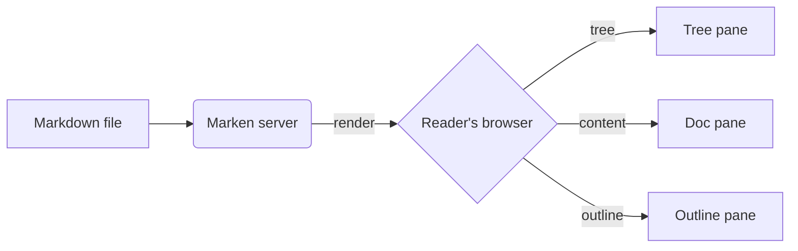

# Markdown features

Everything below renders out of the box.

## GitHub-flavored Markdown

### Tables

| Feature        | Status | Notes                          |
|----------------|:------:|--------------------------------|
| Tables         |   ✅   | with alignment                 |
| Task lists     |   ✅   | rendered as checkboxes         |
| Strikethrough  |   ✅   | ~~deprecated stuff~~           |
| Autolinks      |   ✅   | https://example.com just works |

### Task lists

- [x] Build the markdown viewer
- [x] Ship it in a container
- [ ] Conquer the world

### Code with syntax highlighting

```ts
export function greet(name: string): string {
  return `Hello, ${name}!`
}

console.log(greet('Marken'))
```

```python
def fib(n: int) -> int:
    a, b = 0, 1
    for _ in range(n):
        a, b = b, a + b
    return a
```

## Math (KaTeX)

Inline math: $e^{i\pi} + 1 = 0$ is Euler's identity.

A display block:

$$
\hat{f}(\xi) = \int_{-\infty}^{\infty} f(x)\, e^{-2\pi i x \xi}\, dx
$$

## Diagrams (Mermaid)



## Quotes and callouts

> Markdown is a way to write content for the web that is fundamentally text,
> but has the option to add formatting.

## Wiki-style links

- Internal link: [[Welcome]] resolves by basename across the vault.
- With an alias: [[Welcome|Go home]].
- Broken: [[Nonexistent page]] is shown in red.

## Images

You can use regular Markdown images (paths resolve relative to the file's folder),
or wiki-style embeds: `![[diagram.png]]`.
